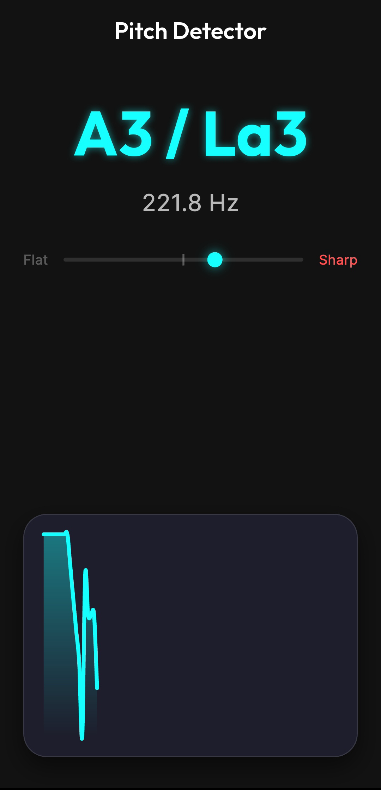

# 🎵 Pitch Detector

A real-time pitch detection app built with **Flutter** and native **Kotlin** audio processing. It listens to audio from the microphone, detects the fundamental frequency using FFT analysis, and displays the corresponding musical note with a live tuning indicator and waveform chart.

<p align="center">
  
</p>

---

## 🎤 How to Use

1. Launch the app on your Android device.
2. The app will automatically request **microphone permission** on startup.
3. Once granted, audio capture begins immediately.
4. **Play or sing a note** — the detected note is displayed in two notations:
   - **Standard notation** (e.g. `A4`, `C#5`)
   - **Solfège notation** (e.g. `La4`, `Do#5`)
5. The **frequency in Hz** is shown below the note name.
6. A **tuning indicator** shows whether the pitch is flat, sharp, or in tune:
   - 🟢 **Green dot** → in tune (within ±10 cents)
   - 🔵 **Cyan dot** → slightly off pitch
   - Labels highlight **Flat** or **Sharp** when significantly out of tune.
7. A **real-time line chart** at the bottom visualizes the stream of detected frequencies.

---

## 🔧 Technical Overview

### Architecture

```
┌────────────────────────────────────────────────────-┐
│                    Flutter (Dart)                   │
│                                                     │
│  AudioService ──► MusicalNoteConverter ──► HomePage │
│  (EventChannel)     (Freq → Note)        (UI/Chart) │
└──────────────┬─────────────────────────────────────-┘
               │ EventChannel
               │ "pitch_detector/audio_stream"
┌──────────────▼─────────────────────────────────────┐
│               Android (Kotlin)                     │
│                                                    │
│  MainActivity ──► AudioStreamHandler               │
│  (registers        (AudioRecord + FFT)             │
│   EventChannel)                                    │
└────────────────────────────────────────────────────┘
```

---

### 🔌 EventChannel for Real-Time Audio Streaming

The app uses Flutter's **`EventChannel`** to establish a continuous stream of data from native Android code to Dart. Unlike `MethodChannel` (request/response), `EventChannel` is designed for **push-based, ongoing data streams** — perfect for real-time audio.

**Dart side** (`AudioService`):
```dart
class AudioService {
  static const _channel = EventChannel('pitch_detector/audio_stream');

  Stream<double> getAudioStream() {
    return _channel.receiveBroadcastStream().map((event) => event as double);
  }
}
```

**Kotlin side** (`MainActivity`):
```kotlin
EventChannel(flutterEngine.dartExecutor.binaryMessenger, CHANNEL)
    .setStreamHandler(AudioStreamHandler())
```

The `EventChannel` bridges native audio data into a Dart `Stream<double>`, which the UI subscribes to via `StreamSubscription`.

---

### 🎙️ AudioRecord in Kotlin

Audio capture is handled natively using Android's **`AudioRecord`** API for low-level, low-latency microphone access:

```kotlin
audioRecord = AudioRecord(
    MediaRecorder.AudioSource.MIC,
    sampleRate,       // 44100 Hz
    AudioFormat.CHANNEL_IN_MONO,
    AudioFormat.ENCODING_PCM_16BIT,
    bufferSize        // 8192 samples
)
```

Recording runs on a **dedicated background thread** to avoid blocking the main/UI thread. Raw PCM samples are read in a loop and processed through the FFT pipeline before being sent to Flutter.

---

### 📊 FFT-Based Pitch Detection Pipeline

The `AudioStreamHandler` implements a multi-stage signal processing pipeline:

| Step | Description |
|------|-------------|
| **1. DC Offset Removal** | Subtracts the mean sample value to center the waveform around zero |
| **2. Hann Windowing** | Applies a Hann window function to reduce spectral leakage |
| **3. FFT** | Performs a real-valued FFT using **JTransforms** (`DoubleFFT_1D`) |
| **4. Magnitude Spectrum** | Computes magnitudes from real/imaginary FFT output pairs |
| **5. Energy Gate** | Filters out low-energy frames (silence/noise) with a threshold of `10000` |
| **6. Peak Detection** | Finds the frequency bin with the highest magnitude |
| **7. Confidence Check** | Rejects frames where the peak is less than 10% of total energy |
| **8. Frequency Conversion** | Converts the peak bin index to a frequency in Hz |
| **9. Smoothing** | Averages the last 5 frequency readings to stabilize output |

The detectable frequency range is **80 Hz – 2000 Hz**, covering most musical instruments and vocal ranges.

---

### 🎼 Frequency-to-Note Conversion

The `MusicalNoteConverter` converts a frequency to a musical note using the **MIDI standard formula**:

```
MIDI = 69 + 12 × log₂(frequency / 440)
```

From the MIDI number, it derives:
- **Note name** — from a 12-note chromatic scale (`C, C#, D, ... B`)
- **Solfège name** — mapped equivalents (`Do, Re, Mi, Fa, Sol, La, Si`)
- **Octave** — `(MIDI ÷ 12) - 1`
- **Cents offset** — deviation from the ideal pitch: `1200 × log₂(f_detected / f_ideal)`

---

### 📈 Real-Time Visualization

The UI uses **`fl_chart`** to render a live line chart of detected frequencies. Key details:

- Maintains a rolling buffer of the **last 100 data points**
- Chart auto-scales Y-axis based on `min`/`max` of visible data
- Smooth curved line with a gradient fill for visual clarity
- Updates reactively on each new `Stream` event via `setState`

---

## 📁 Project Structure

```
lib/
├── main.dart                          # App entry point, theme, permissions
├── models/
│   └── note_result.dart               # NoteResult data model
├── services/
│   ├── audio_service.dart             # EventChannel wrapper (Stream<double>)
│   └── musical_note_converter.dart    # Frequency → note/solfège conversion
└── ui/
    └── home_page.dart                 # Main UI with chart & tuning indicator

android/app/src/main/kotlin/.../
├── MainActivity.kt                    # Registers the EventChannel
└── AudioStreamHandler.kt             # Native audio capture + FFT processing
```

---

## 📚 Dependencies

| Package | Purpose |
|---------|---------|
| [`permission_handler`](https://pub.dev/packages/permission_handler) | Runtime microphone permission requests |
| [`fl_chart`](https://pub.dev/packages/fl_chart) | Real-time line chart visualization |
| [`google_fonts`](https://pub.dev/packages/google_fonts) | Inter & Outfit typography |
| [JTransforms](https://github.com/wendykierp/JTransforms) | FFT computation on Android (Kotlin) |
